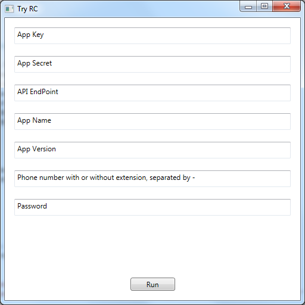

# TryRC

Try RingCentral

This is a WPF application which demostrates how to call the RingCentral C# SDK.

Currently what this app does is to do authentication then call the sms endpoint to send sms.

In the feature, it will demostrate the usage of more API service endpoints.

## todo
